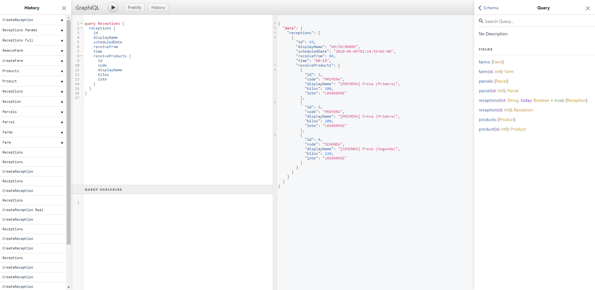

# GraphQL Odoo


[](http://www.gnu.org/licenses/lgpl-3.0-standalone.html)
[](https://github.com/OCA/rest-framework/tree/13.0/graphql_base)

Es un módulo creado para el software de planificación de recursos empresariales [Odoo](https://github.com/odoo/odoo). Este módulo es una implementación del módulo [graphql_base](https://github.com/OCA/rest-framework/tree/13.0/graphql_base) el cual pertenece al [rest-framework](https://github.com/OCA/rest-framework/tree/13.0) creado por la comunidad de OCA.

## Visión General

El módulo crea una interfaz de programación de aplicaciones (API) integrada en [Odoo Enterprise](https://www.odoo.com/es_ES/),  permitiendo acceder y modificar los datos de los diferentes modelos que tiene Odoo.

Implementa un esquema mediante la librería de [Graphene](https://graphene-python.org/), en el cual se han definido una serie de consultas, mutaciones y tipos de datos.

## Uso

Para usar este módulo, dirígete a la siguiente dirección para usar el entorno que ofrece GraphQL:

```bash
curl http://server-ip:8069/graphiql
```

En caso de consumir esta API desde aplicaciones externas, dirige las peticiones a la siguiente dirección:

```bash
curl -X POST http://server-ip:8069/graphql
```

Para comenzar a trabajar con este módulo, es recomendable tener conocimiento de los siguientes conceptos

- Aprenda los [conceptos básicos de GraphQL](https://graphql.org/learn/)
- Examine las consultas de ejemplo guardadas en el historial
- Para consumir la API desde aplicaciones Web mírese la [documentación de Apollo-Client](https://www.apollographql.com/docs/)
- Comience a realizar sus propias consultas al esquema de GraphQL

## GraphiQL

Este entorno nos permite realizar interactuar con el esquema de GraphQL mediante una aplicación web.

### Entorno

> En la siguiente imagen se puede observar en la parte derecha las consultas disponibles en el esquema y en el lado izquierda el historial el cual contiene consultas de ejemplo.



## Autenticación

Para consumir la API es necesario haber realizado una autenticación previa. Los datos necesarios para realizar la autenticación es la siguiente:

- `db` nombre de la base de datos
- `login` nombre del usuario
- `password` contraseña del usuario

```bash
curl \
  -H 'Content-Type: application/json' \
  -X POST \
  -d '{"params": { "db": database, "login": username, "password": password }}' \
  http://server-ip:8069/web/session/authenticate
```

## Créditos

Este módulo ha sido creado como parte del proyecto de final de grado por Alejandro Pérez Álvarez.

Para cualquier consulta, contacta con <alejperez99@hotmail.com>.
